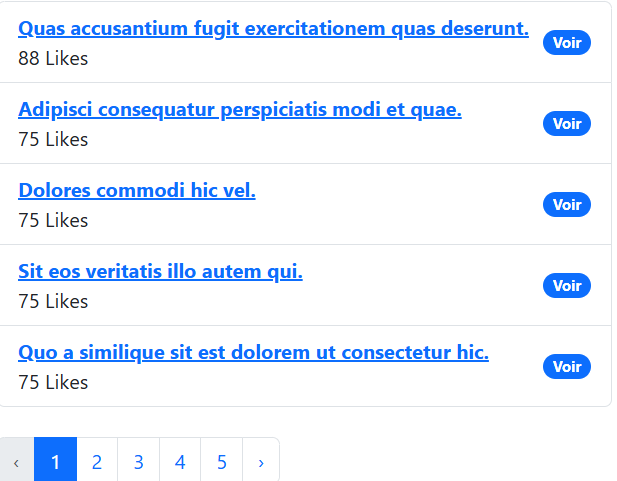
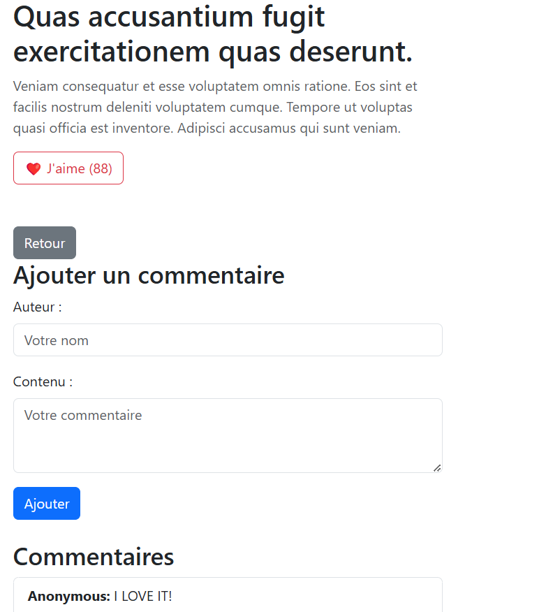

# Projet Test Technique Laravel - Sujet 1 : Mini-système de Blog

## Auteur : Stark Kassa
Je soumets ce projet dans le cadre de ma candidature pour un poste chez **France Surgery**.

---

## Description du projet
Ce projet implémente un mini-système de blog avec Laravel. Il permet de :
- **Créer, lire, mettre à jour et supprimer des articles** (CRUD complet).
- **Ajouter des commentaires aux articles**.
- **Afficher les commentaires associés à chaque article**.
- **Liker les articles.**
- Bonus : Ajout d'une pagination pour une meilleure gestion des données affichées.

---

## Fonctionnalités principales
### Gestion des Articles
1. **Créer un article**
   - Interface utilisateur permettant de saisir un titre et un contenu pour l'article.
   - Validation des données saisies (titre et contenu obligatoires).

2. **Afficher les articles**
   - Liste paginée des articles avec leur nombre de likes.
   - Détail de chaque article avec ses commentaires.

3. **Mettre à jour et supprimer**
   - Modifier un article existant via un formulaire dédié.
   - Supprimer un article.

### Gestion des Commentaires
- Ajouter un commentaire à un article.
- Valider les champs obligatoires (auteur et contenu).

### Système de Likes
- Les utilisateurs peuvent liker les articles.
- Le nombre de likes est affiché pour chaque article.

---

## Installation
### Prérequis
- PHP >= 8.0
- Composer
- MySQL
- Laravel 10

### Étapes
1. **Cloner le projet** :
   ```bash
   git clone <lien-du-repo>
   cd <nom-du-repo>
   ```

2. **Installer les dépendances** :
   ```bash
   composer install
   ```

3. **Configurer l'application** :
   - Copier le fichier `.env.example` en `.env` :
     ```bash
     cp .env.example .env
     ```
   - Configurer la connexion à la base de données dans le fichier `.env` :
     ```
     DB_CONNECTION=mysql
     DB_HOST=127.0.0.1
     DB_PORT=3306
     DB_DATABASE=blog
     DB_USERNAME=root
     DB_PASSWORD=secret
     ```

4. **Générer la clé d'application** :
   ```bash
   php artisan key:generate
   ```

5. **Appliquer les migrations** :
   ```bash
   php artisan migrate
   ```

6. **Remplir la base de données avec des données de test** :
   ```bash
   php artisan db:seed
   ```

7. **Démarrer le serveur de développement** :
   ```bash
   php artisan serve
   ```
   Accédez à l'application via [http://127.0.0.1:8000](http://127.0.0.1:8000).

---

## Documentation des Routes
### Articles
| Méthode | URI                  | Action                  |
|---------|----------------------|-------------------------|
| GET     | /posts               | Afficher tous les articles (index) |
| GET     | /posts/create        | Formulaire de création d'article   |
| POST    | /posts               | Créer un nouvel article            |
| GET     | /posts/{id}          | Afficher un article spécifique     |
| PUT     | /posts/{id}          | Mettre à jour un article           |
| DELETE  | /posts/{id}          | Supprimer un article               |

### Commentaires
| Méthode | URI                        | Action                               |
|---------|----------------------------|--------------------------------------|
| POST    | /posts/{id}/comments       | Ajouter un commentaire à un article |

### Likes
| Méthode | URI                  | Action                                |
|---------|----------------------|---------------------------------------|
| POST    | /posts/{id}/like     | Ajouter un like à un article         |

---

## Tests Unitaires
### Couverture des Tests
- **Articles** :
  - Création, affichage, mise à jour et suppression.
- **Commentaires** :
  - Ajout de commentaire.
- **Likes** :
  - Incrémentation des likes sur un article.

### Exécuter les tests
```bash
vendor/bin/pest
```

---

## Screenshots
### Liste des articles


### Détail d'un article avec commentaires


---

## Bonus
- **Pagination** : Implémentée pour les listes d'articles (5 articles par page).
- **Validation** : Chaque formulaire inclut une validation robuste pour éviter les erreurs.

---

## Suite du Projet Test Technique Laravel - Sujet 2 : Authentification Avancée et Gestion des Rôles

Ce projet est une extension du sujet 1, visant à renforcer la sécurité et à introduire une gestion avancée des rôles utilisateur.

---

## Nouvelles Fonctionnalités

### 1. Double Authentification (2FA)

#### Fonctionnalités :
- Les utilisateurs doivent valider un code 2FA envoyé par e-mail pour finaliser leur connexion.
- Le code expire après 10 minutes pour des raisons de sécurité.

#### Mise en œuvre :

- **Migration pour ajouter les colonnes 2FA** :

  ```php
  public function up()
  {
      Schema::table('users', function (Blueprint $table) {
          $table->string('two_factor_code')->nullable();
          $table->timestamp('two_factor_expires_at')->nullable();
      });
  }
  ```

- **Code de génération et vérification** :

  - *Génération d'un code 2FA dans le modèle `User` :*

    ```php
    public function generateTwoFactorCode()
    {
        $this->two_factor_code = rand(100000, 999999);
        $this->two_factor_expires_at = now()->addMinutes(10);
        $this->save();

        Mail::to($this->email)->send(new TwoFactorCodeMail($this->two_factor_code));
    }

    public function resetTwoFactorCode()
    {
        $this->two_factor_code = null;
        $this->two_factor_expires_at = null;
        $this->save();
    }
    ```

  - *Middleware pour vérifier si l'utilisateur a validé le 2FA :*

    ```php
    public function handle($request, Closure $next)
    {
        if (auth()->check() && auth()->user()->two_factor_code) {
            return redirect()->route('verify.2fa');
        }

        return $next($request);
    }
    ```

- **Route de vérification 2FA :**

  ```php
  Route::middleware('auth')->group(function () {
      Route::get('verify-2fa', [AuthController::class, 'showTwoFactorForm'])->name('verify.2fa');
      Route::post('verify-2fa', [AuthController::class, 'verifyTwoFactor']);
  });
  ```

- **Vue pour la vérification 2FA :**

  ```blade
  @extends('layouts.app')

  @section('title', 'Vérification 2FA')

  @section('content')
  <div class="container mt-4">
      <h1>Vérification 2FA</h1>
      @if(session('success'))
          <div class="alert alert-success">{{ session('success') }}</div>
      @endif
      <form action="{{ route('verify.2fa') }}" method="POST">
          @csrf
          <div class="mb-3">
              <label for="code" class="form-label">Code :</label>
              <input type="text" class="form-control" name="code" id="code" required>
          </div>
          <button type="submit" class="btn btn-primary">Vérifier</button>
      </form>
  </div>
  @endsection
  ```

---

### 2. Gestion des Rôles

#### Fonctionnalités :
- Les administrateurs peuvent gérer les articles et modérer les commentaires.
- Les utilisateurs réguliers peuvent consulter les articles, liker et commenter.

#### Mise en œuvre :

- **Migration pour ajouter un rôle dans la table `users` :**

  ```php
  public function up()
  {
      Schema::table('users', function (Blueprint $table) {
          $table->string('role')->default('user');
      });
  }
  ```

- **Middleware pour les administrateurs :**

  ```php
  public function handle($request, Closure $next)
  {
      if (auth()->check() && auth()->user()->role !== 'admin') {
          abort(403, 'Accès non autorisé.');
      }

      return $next($request);
  }
  ```

- **Routes protégées pour les administrateurs :**

  ```php
  Route::middleware(['auth', 'admin'])->group(function () {
      Route::delete('posts/{post}', [PostController::class, 'destroy'])->name('posts.destroy');
      Route::put('posts/{post}', [PostController::class, 'update'])->name('posts.update');
  });
  ```

- **Indicateur visuel pour distinguer les rôles dans les vues :**

  ```blade
  @foreach($users as $user)
      <li class="list-group-item">
          <strong>{{ $user->name }}</strong> - {{ $user->email }}
          @if($user->role === 'admin')
              <span class="badge bg-danger">Admin</span>
          @else
              <span class="badge bg-secondary">User</span>
          @endif
      </li>
  @endforeach
  ```

---

## Tests Unitaires

### Couverture des Tests
- **2FA** :
  - Génération et vérification des codes 2FA.
  - Expiration des codes 2FA.

- **Rôles** :
  - Accès limité aux administrateurs pour certaines routes.
  - Vérification des permissions pour les utilisateurs réguliers.

### Exemple de Test :

```php
public function test_admin_can_delete_post()
{
    $admin = User::factory()->create(['role' => 'admin']);
    $post = Post::factory()->create();

    $response = $this->actingAs($admin)->delete(route('posts.destroy', $post->id));

    $response->assertStatus(200);
    $this->assertDatabaseMissing('posts', ['id' => $post->id]);
}
```

### Commande pour exécuter les tests

```bash
vendor/bin/pest
```

---

## Conclusion

Avec ces ajouts, le projet est maintenant sécurisé grâce à la double authentification et offre une gestion robuste des rôles utilisateur. Cela répond aux exigences du sujet 2 et renforce l'application pour une utilisation réelle.

---


---

Merci pour votre attention. Ce projet est prêt à être évalué par l'équipe technique de France Surgery.

---

## Contact
- **Stark Kassa**
- Email : stark.kassa@example.com
